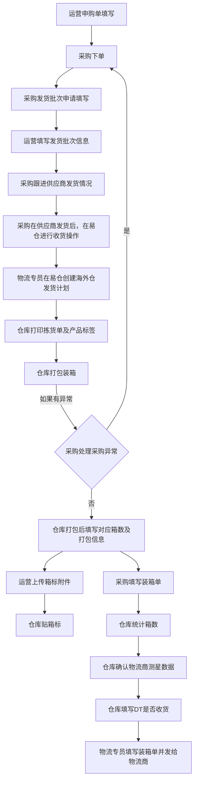

```mermaid
graph TD;
    A[运营申购单填写] --> B[采购下单]
    B --> C[采购发货批次申请填写]
    C --> D[运营填写发货批次信息]
    D --> E[采购跟进供应商发货情况]
    E --> F[采购在供应商发货后，在易仓进行收货操作]
    F --> G[物流专员在易仓创建海外仓发货计划]
    G --> H[仓库打印拣货单及产品标签]
    H --> I[仓库打包装箱]
    I --> |如果有异常| J{采购处理采购异常}
    J -- 是 --> B
    J -- 否 --> K[仓库打包后填写对应箱数及打包信息]
    K --> L[运营上传箱标附件]
    L --> M[仓库贴箱标]
    K --> N[采购填写装箱单]
    N --> O[仓库统计箱数]
    O --> P[仓库确认物流商测星数据]
    P --> Q[仓库填写DT是否收货]
    Q --> R[物流专员填写装箱单并发给物流商]
```
graph LR
